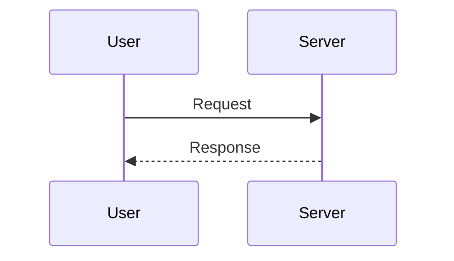
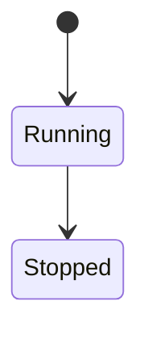
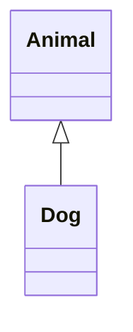

| Task | Status | Owner | Notes |
|---|---|---|---|
| Auth API | 🚧 | Sam | Waiting on OAuth flow |
| Billing | ✅ | Alex | Shipped |

- [ ] task 1
- [x] task 2
  - [ ] task 2a
  - [ ] ~~task 2b~~

Implementation notes

Detailed notes here.

